# Calagopus Branding

<https://calagopus.com>

> [!NOTE]  
> This repository should only be used as reference. Do NOT use for content delivery (CDN). Folder structure may be changed without notice.

## Images

### Logos

|     |     |
| --- | --- |
| 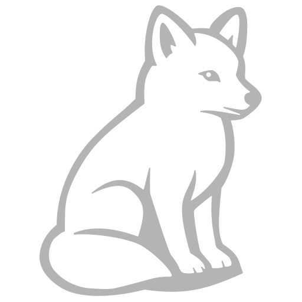 | 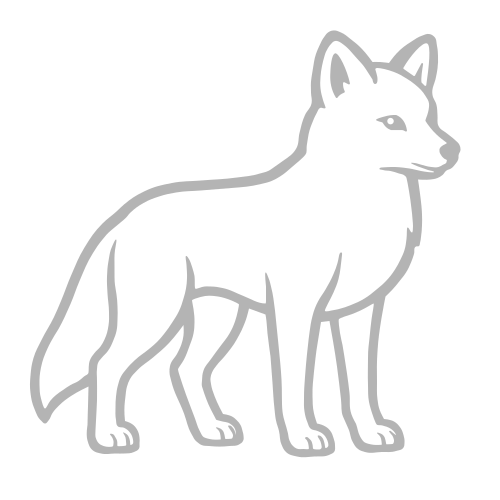 |
| 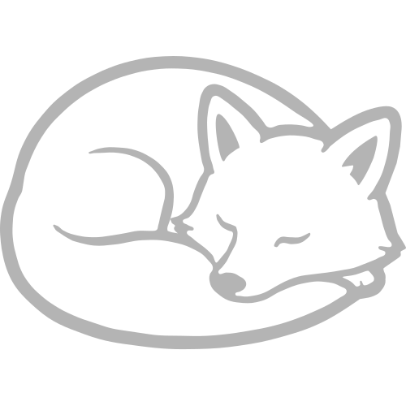 | 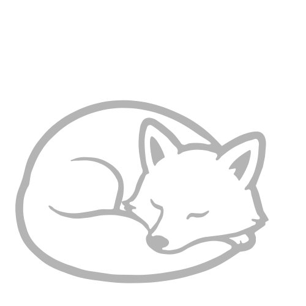 |

### Banners

|     |     |
| --- | --- |
| 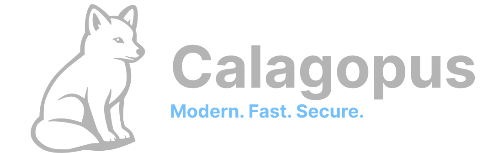 | 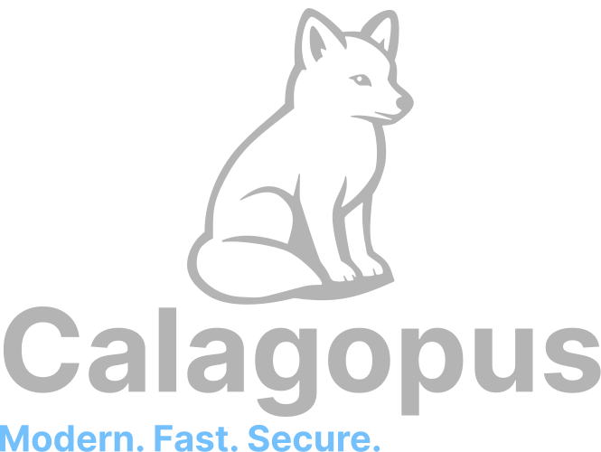 |
| 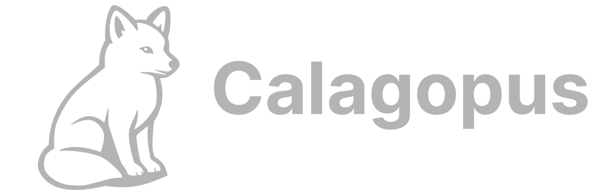 | 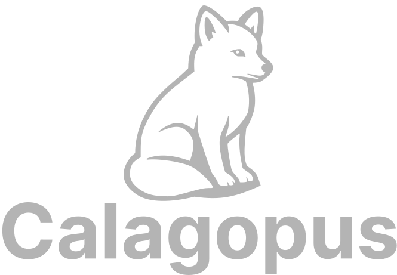 |
| 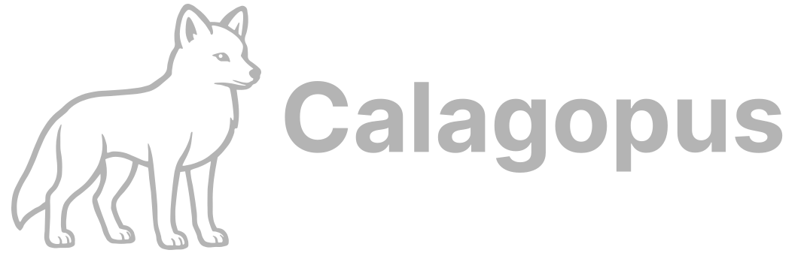 | 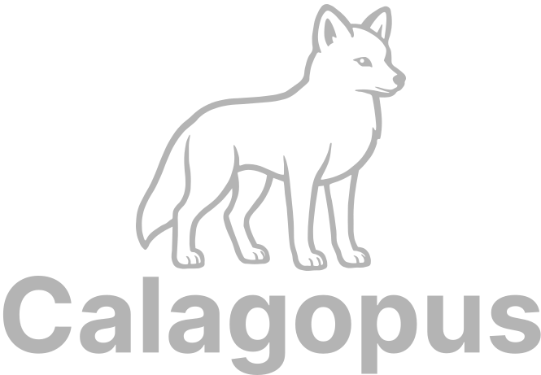 |

### Badges

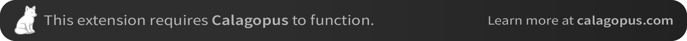

## Colors

| Usecase | HEX | Example |
| -------- | ------- | ------- |
| Fox White | #ffffff |  |
| Fox Accent | #b4b4b4 | 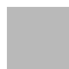 |
| Text Primary | #74c0fc | 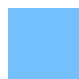 |
| Background | #222222 | 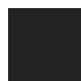 |
| Background Accent | #2e2e2e |  |
